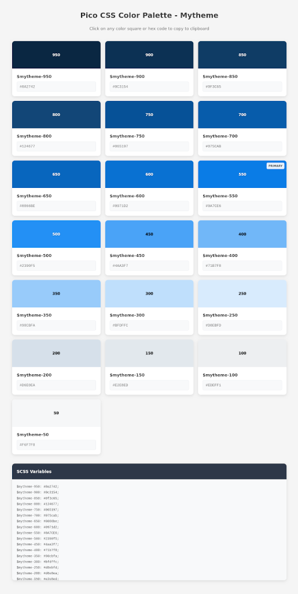

# Pico CSS palette generator

This repo helps you **generate a custom primary color** based [Pico CSS](https://picocss.com/) theme.

*Context: Pico CSS comes with a series of predefined colors. Unfortunately, this does not work if you want to build a Pico CSS based web site with your own primary color.*

This tool lets you generate your own Pico CSS theme based on your own primary color.

The process is done through 3 steps:

1. generate the palette based on your own primary color
2. get Pico CSS and patch files
3. build the theme



## Build your own theme

### 1. Generate your palette

Here is the command in order to build your palette:

```bash
python color_palette_generator.py --palette-name mytheme --primary-color '#e74c3c'
```

This will generate a series of 19 colors to be imported into Pico CSS.

It also generates an html palette file which you can have a look at using firefox:

```shell
firefox mytheme_palette.html
```

### 2. Build the Pico CSS theme based on your palette

First, clone the Pico CSS repo:

```
git clone git@github.com:picocss/pico.git
```

Now you will insert your theme into required js & scss files.

Go into your freshly cloned repo:

```
cd pico/
```


#### Patch the `scripts/build-themes.js` file

Add your theme in the `themeColors` list:

```bash
sed -i '/const themeColors = \[/a\  "mytheme",' scripts/build-themes.js
```

#### Patch the `scss/colors/utilities/_settings.scss` file

Add your theme name to the `color-families` variable:

```bash
sed -i '/"color-families": (/a\        mytheme,' scss/colors/utilities/_settings.scss
```

#### Patch the `scss/colors/_index.scss` file

Insert your colors in the `_index.scss` file at line 4 (after black and white definition):

*Note: these colors are the one generated using the `color_palette_generator.py` python script.*


```scss
// mytheme
$mytheme-950: #0a2742;
$mytheme-900: #0c3154;
$mytheme-850: #0f3c65;
$mytheme-800: #124677;
$mytheme-750: #065197;
$mytheme-700: #075cab;
$mytheme-650: #0866be;
$mytheme-600: #0971d2;
$mytheme-550: #0A7CE6;
$mytheme-500: #2390f5;
$mytheme-450: #4aa3f7;
$mytheme-400: #71b7f8;
$mytheme-350: #98cbfa;
$mytheme-300: #bfdffc;
$mytheme-250: #d8ebfd;
$mytheme-200: #d6e0ea;
$mytheme-150: #e2e8ed;
$mytheme-100: #edeff1;
$mytheme-50: #f6f7f8;
```

and just after the `$colors: (...)` beginning:

```scss
$colors: (
  mytheme: (
    950: $mytheme-950,
    900: $mytheme-900,
    850: $mytheme-850,
    800: $mytheme-800,
    750: $mytheme-750,
    700: $mytheme-700,
    650: $mytheme-650,
    600: $mytheme-600,
    550: $mytheme-550,
    500: $mytheme-500,
    450: $mytheme-450,
    400: $mytheme-400,
    350: $mytheme-350,
    300: $mytheme-300,
    250: $mytheme-250,
    200: $mytheme-200,
    150: $mytheme-150,
    100: $mytheme-100,
    50: $mytheme-50,
    main: $mytheme,
  ), 
  [...]
)
```

#### Patch the `scss/themes/default/_theme-colors.scss` file

Add your mapping for dark/light mode in the `_theme-colors.scss` file:

```scss
@use "sass:color";
@use "sass:map";
@use "../../colors" as *;
@use "../../settings" as *;

$color-mappings: (
  "mytheme": (
    "dark": (
      "text-selection-color": rgba($mytheme-350, 0.1875),
      "primary": $mytheme-350,
      "primary-background": $mytheme-550,
      "primary-underline": rgba($mytheme-350, 0.5),
      "primary-hover": $mytheme-250,
      "primary-hover-background": $mytheme-500,
      "primary-focus": rgba($mytheme-350, 0.375),
      "primary-inverse": $white,
      "switch-thumb-box-shadow": 0 0 0 rgba(0, 0, 0, 0),
    ),
    "light": (
      "text-selection-color": rgba($mytheme-400, 0.25),
      "primary": $mytheme-550,
      "primary-background": $mytheme-550,
      "primary-underline": rgba($mytheme-550, 0.5),
      "primary-hover": $mytheme-650,
      "primary-hover-background": $mytheme-600,
      "primary-focus": rgba($mytheme-400, 0.5),
      "primary-inverse": $white,
      "switch-thumb-box-shadow": 0 0 0 rgba(0, 0, 0, 0),
    ),
  ),
```

### 3. Build the Pico CSS theme

```
npm install
npm run build
```

Your theme is now available in the `css/` folder:

```shell
damien@computer:~/proj/picocss-theme-generator/pico$ ls -1 css/*mytheme*
css/pico.classless.conditional.mytheme.css
css/pico.classless.conditional.mytheme.min.css
css/pico.classless.mytheme.css
css/pico.classless.mytheme.min.css
css/pico.conditional.mytheme.css
css/pico.conditional.mytheme.min.css
css/pico.fluid.classless.conditional.mytheme.css
css/pico.fluid.classless.conditional.mytheme.min.css
css/pico.fluid.classless.mytheme.css
css/pico.fluid.classless.mytheme.min.css
css/pico.mytheme.css
css/pico.mytheme.min.css
```
